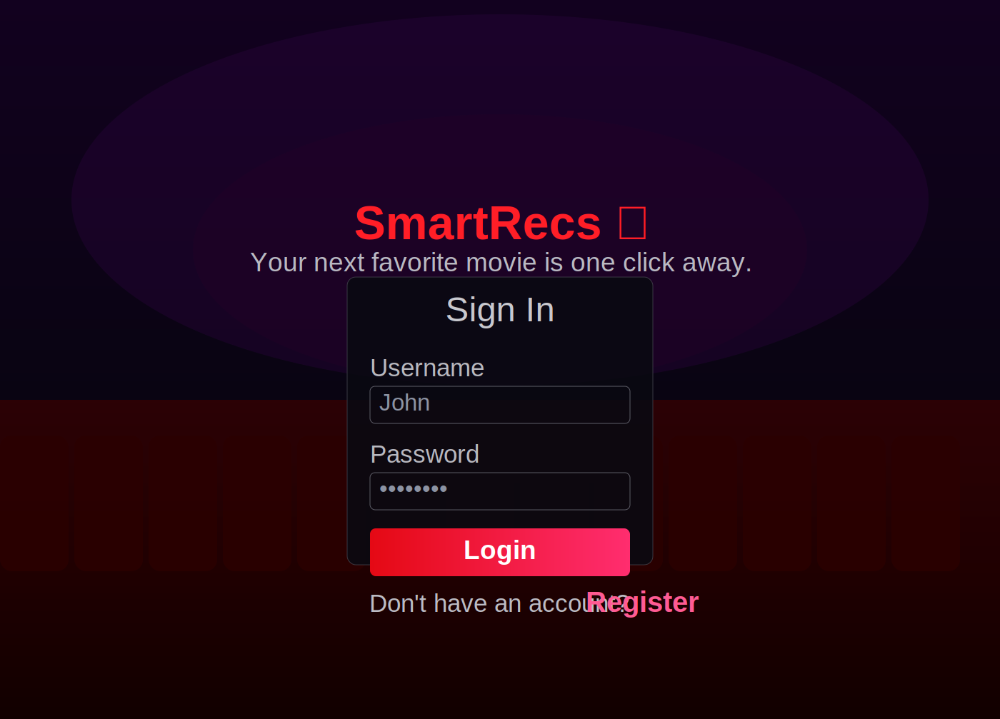

# 🎬 SmartRecs — AI Movie Recommendation Web App



SmartRecs is a Flask web app that helps users rate movies and get personalized recommendations using a hybrid ML engine (content-based + collaborative filtering).

## ✨ Features
- 🔐 User auth (register/login/logout)
- ⭐ Rate movies with 1–5 stars
- 🤖 Hybrid recommendations tailored per user
- 🎞️ Movie details with genre, year, and trailer modal
- 🔎 Search + filter on Rate and Recommendations pages
- 🌙 Clean dark UI

## 🧠 How recommendations work
1. **Content-based filtering**: TF-IDF on genres + cosine similarity.
2. **Collaborative filtering**: user-user similarity from ratings matrix.
3. **Hybrid score**:

```text
final_score = 0.5 * content_score + 0.5 * collaborative_score
```

## 🏗️ Tech stack
- **Backend**: Flask
- **ML/Data**: pandas, numpy, scikit-learn
- **DB**: SQLite
- **Frontend**: Jinja templates + Bootstrap + custom CSS
- **Prod server**: gunicorn

## 📁 Project structure
```text
SmartRecs-AI-Movies/
├── app.py
├── recommender.py
├── models.py
├── requirements.txt
├── Procfile
├── railway.toml
├── data/
├── static/
│   ├── css/style.css
│   └── images/
└── templates/
```

## 🚀 Run locally
```bash
python -m venv .venv
source .venv/bin/activate   # Windows: .venv\Scripts\activate
pip install -r requirements.txt
python app.py
```
Open: `http://127.0.0.1:5000`

## 🌐 Deploy to Railway (recommended, easiest)
Railway is a very easy option for this Flask project and is already prepared in this repo (`Procfile` + `railway.toml`).

### 👶 Baby steps
1. Push this repo to GitHub.
2. Go to Railway → **New Project** → **Deploy from GitHub Repo**.
3. Select this repo.
4. In Railway **Variables**, add these keys:
   - `SECRET_KEY` (required)
   - `TMDB_API_KEY` (optional)
   - `OMDB_API_KEY` (optional)

   Example values you can paste:
   - `SECRET_KEY=change-this-to-a-long-random-secret-string`
   - `TMDB_API_KEY=` *(leave empty if you do not have one)*
   - `OMDB_API_KEY=` *(leave empty if you do not have one)*

   Generate a strong `SECRET_KEY` locally with:
   ```bash
   python -c "import secrets; print(secrets.token_urlsafe(48))"
   ```

   ✅ App works even without TMDB/OMDB keys (it falls back to built-in descriptions, posters, and trailer search embeds).
5. Railway will auto-build using `requirements.txt`.
6. Railway will start app using:
   - `gunicorn app:app --bind 0.0.0.0:$PORT --workers 2 --threads 4 --timeout 120`
7. Open generated Railway domain 🎉

## 🟢 If you want an alternative
**Render** is also simple:
- Build command: `pip install -r requirements.txt`
- Start command: `gunicorn app:app --bind 0.0.0.0:$PORT`
- Add `SECRET_KEY` env var

## 🔒 Security notes
- Passwords are hashed (`werkzeug.security`).
- Session-based route protection is enabled.
- Set a strong `SECRET_KEY` in production.


---
Made with ❤️ + 🍿 by SmartRecs.
