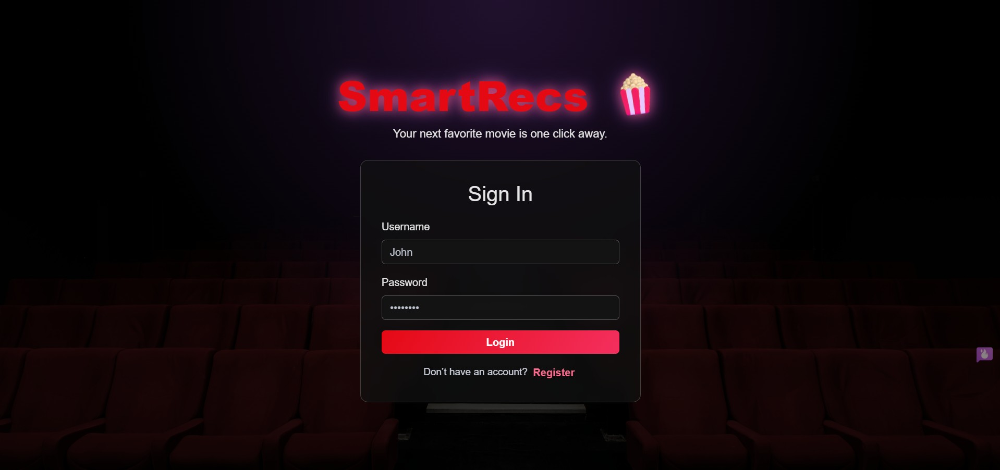

# 🎬 SmartRecs — AI Movie Recommendation Web App



Built SmartRecs AI Movies, an AI-powered full-stack web app that personalizes movie recommendations based on user ratings and preference patterns.
The platform includes user authentication, rating workflows, dynamic filtering, rich movie detail modals, and responsive mobile-first UI improvements.
This project strengthened my skills in recommender systems, backend engineering, data handling, and shipping production-ready web applications.

## ✨ Features
- 🔐 User auth (register/login/logout)
- ⭐ Rate movies with 1–5 stars
- 🤖 Hybrid recommendations tailored per user
- 🎞️ Movie details with genre, year, and trailer modal
- 🔎 Search + filter on Rate and Recommendations pages
- 🌙 Clean dark UI

## 🧠 How recommendations work
1. **Content-based filtering**: TF-IDF on genres + cosine similarity.
2. **Collaborative filtering**: user-user similarity from ratings matrix.
3. **Hybrid score**:

```text
final_score = 0.5 * content_score + 0.5 * collaborative_score
```

## 🏗️ Tech stack
- **Backend**: Flask
- **ML/Data**: pandas, numpy, scikit-learn
- **DB**: SQLite
- **Frontend**: Jinja templates + Bootstrap + custom CSS
- **Prod server**: gunicorn

## 📁 Project structure
```text
SmartRecs-AI-Movies/
├── app.py
├── recommender.py
├── models.py
├── requirements.txt
├── Procfile
├── railway.toml
├── data/
├── public/
│   └── static/
│       ├── css/style.css
│       └── images/
└── templates/
```

## 🚀 Run locally
```bash
python -m venv .venv
source .venv/bin/activate   # Windows: .venv\Scripts\activate
pip install -r requirements.txt
python app.py
```
Open: `http://127.0.0.1:5000`

## 🌐 Deploy to Railway (recommended, easiest)
Railway is a very easy option for this Flask project and is already prepared in this repo (`Procfile` + `railway.toml`).

## Deploy to Vercel
This project is also prepared for Vercel using `vercel.json`. Vercel detects the Flask app from `app.py`, and static assets are stored in `public/static` so they can be served from Vercel's public asset pipeline.

1. Push this repository to GitHub.
2. Go to <https://vercel.com/new>.
3. Import the GitHub repository.
4. Set **Framework Preset** to `Flask` if Vercel does not auto-detect it.
5. Keep the root directory as the repository root.
6. Add environment variables in Vercel Project Settings:
   - `SECRET_KEY`: any long random string.
   - `TMDB_API_KEY`: optional, for live TMDB lookups.
   - `OMDB_API_KEY`: optional, for live OMDB lookups.
7. Click **Deploy**.
8. After deployment, open the generated Vercel URL and confirm the SmartRecs icon appears in the browser tab.

Note: Vercel Functions use a read-only project filesystem. The app uses `/tmp` for SQLite on Vercel so the demo can run, but `/tmp` is not permanent storage. Use a hosted database for production user accounts and ratings.

---
Made with ❤️ + 🍿 by SmartRecs.
